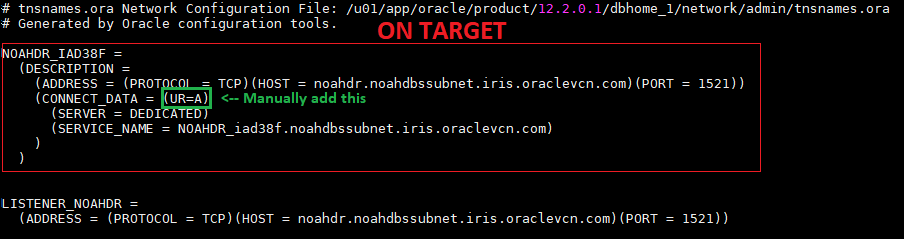

Manual Active Oracle Data Guard
=======================================================


## Table of Contents
* [Assumptions](#assumptions)
* [Setting up connectivity](#setting_up_connectivity)


<!-- ASSUMPTIONS SECTION START -->
## Assumptions
1. **Source** is Oracle Database 12c EE High Perf Release 12.2.0.1.0 - 64bit Production.
2. **Target** has Oracle Database 12c EE High Perf Release 12.2.0.1.0 - 64bit Production **binaries**.
3. If using OCI, both databases have appropriate security lists that can allow communication both ways.
4. You have the correct password for the SYS user on the source database.
5. Both Oracle environments have been set with .oraenv

#### Source Information
1. ORACLE_SID = NOAHONE
2. ORACLE_UNQNAME = ***NOAHONE_iad2b7***

#### Target Information
1. ORACLE_SID = NOAHONE
2. ORACLE_UNQNAME = ***NOAHDR_iad38f***

#### What are binaries?
Binaries are when you have Oracle Database software installed, but you do not have any databases provisioned. You can achieve this by adding a new entry to the oratab, and using the same Oracle Home as a running database. You could also just install Oracle Software, or drop the current database.

#### What if I don't know the source SYS password?
***For sake of testing***, you can edit the SYS password like so -:
```
$ sqlplus / as sysdba
SQL> ALTER USER SYS IDENTIFIED BY [password];
SQL> ALTER USER SYSTEM IDENTIFIED BY [password];
SQL> exit
```
Otherwise, contact your DBA

[Top](#Table-of-Contents)
<!-- ASSUMPTIONS SECTION END -->
<!-- =========================================================================================== -->
<!-- CONNECTIVITY SECTION START -->
## Setting up connectivity between source and target
In order to allow cross connection between our two databases, we're going to have to add entries to both tnsnames.ora in $ORACLE_HOME/network/admin. Go ahead and cat the tnsnames.ora, and you can get an idea of what it looks like.

**On source**
```
$ cat $ORACLE_HOME/network/admin/tnsnames.ora
```


**On target**
```
$ cat $ORACLE_HOME/network/admin/tnsnames.ora
```



[Top](#Table-of-Contents)
<!-- CONNECTIVITY SECTION END -->
