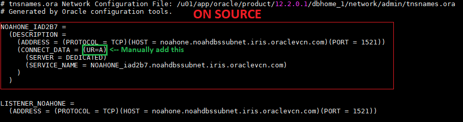
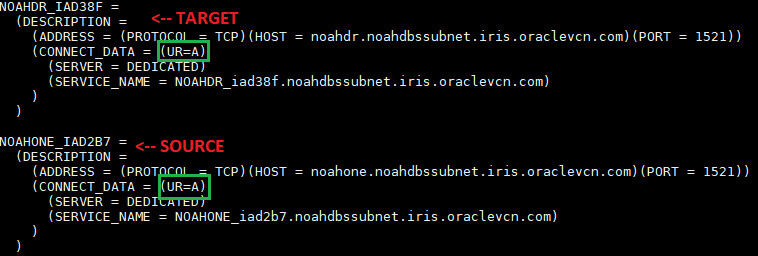

Manual Active Oracle Data Guard
=======================================================


## Table of Contents
* [Assumptions](#assumptions)
* [Setting up connectivity](#setting_up_connectivity)


<!-- ASSUMPTIONS SECTION START -->
## Assumptions
1. **Source** is Oracle Database 12c EE High Perf Release 12.2.0.1.0 - 64bit Production.
2. **Target** has Oracle Database 12c EE High Perf Release 12.2.0.1.0 - 64bit Production **binaries**.
3. If using OCI, both databases have appropriate security lists that can allow communication both ways.
4. You have the correct password for the SYS user on the source database.
5. Both Oracle environments have been set with .oraenv

#### Source Information
1. ORACLE_SID = NOAHONE
2. ORACLE_UNQNAME = ***NOAHONE_iad2b7***

#### Target Information
1. ORACLE_SID = NOAHONE
2. ORACLE_UNQNAME = ***NOAHDR_iad38f***

#### What are binaries?
Binaries are when you have Oracle Database software installed, but you do not have any databases provisioned. You can achieve this by adding a new entry to the oratab, and using the same Oracle Home as a running database. You could also just install Oracle Software, or drop the current database.

#### What if I don't know the source SYS password?
***For sake of testing***, you can edit the SYS password like so -:
```
$ sqlplus / as sysdba
SQL> ALTER USER SYS IDENTIFIED BY [password];
SQL> ALTER USER SYSTEM IDENTIFIED BY [password];
SQL> exit
```
Otherwise, contact your DBA

[Top](#Table-of-Contents)

## Preparing source database
First thing, we need to make sure our source database is in ARCHIVELOG mode.
```
$ sqlplus / as sysdba
SQL> select log_mode from v$database;
```


#### Editing source Parameters
Next, we need to enable force logging and flashback on parameters. The parameters may already be enabled, which will give you an error -- but that's okay.
```
$ sqlplus / as sysdba
SQL> alter database force logging;
SQL> alter database flashback ON;
SQL> select force_logging from v$database;
SQL> select flashback_on from v$database;
```


Now, we need to edit these source parameters. I would reccomened copying this into a notepad, and filling it out with your values. You can paste this all at once in SQL, just make sure it's line by line.
```
ALTER SYSTEM SET LOG_ARCHIVE_CONFIG='DG_CONFIG=(source_unqname,target_unqname)' scope=both;
ALTER SYSTEM SET LOG_ARCHIVE_DEST_1='location=USE_DB_RECOVERY_FILE_DEST’;
ALTER SYSTEM SET LOG_ARCHIVE_DEST_2='SERVICE=target_unqname LGWR ASYNC VALID_FOR=(ONLINE_LOGFILES,PRIMARY_ROLE) DB_UNIQUE_NAME=target_unqname' scope=both;
ALTER SYSTEM SET LOG_ARCHIVE_DEST_STATE_1=ENABLE scope=both;
ALTER SYSTEM SET LOG_ARCHIVE_DEST_STATE_2=ENABLE scope=both;
ALTER SYSTEM SET LOG_ARCHIVE_FORMAT='%t_%s_%r.dbf' SCOPE=SPFILE;
ALTER SYSTEM SET LOG_ARCHIVE_MAX_PROCESSES=30 scope=both;
ALTER SYSTEM SET REMOTE_LOGIN_PASSWORDFILE=EXCLUSIVE SCOPE=SPFILE;
ALTER SYSTEM SET fal_client=source_unqname scope=both;
ALTER SYSTEM SET fal_server=target_unqname scope=both;
ALTER SYSTEM SET STANDBY_FILE_MANAGEMENT=AUTO;
```


#### Copying source wallet directory, and password files
By default, OCI encrypts the Database. This means we have to copy both the password file, as well as the contents of the wallet directory from our Source database, and add it to our target database. I am going to copy it to a shared NFS between the two servers. There's other ways like WinSCP, or using Linux Secure Copy (scp).

<!-- ASSUMPTIONS SECTION END -->
<!-- =========================================================================================== -->
<!-- CONNECTIVITY SECTION START -->
## Setting up connectivity between source and target
In order to allow cross connection between our two databases, we're going to have to add entries to both tnsnames.ora in $ORACLE_HOME/network/admin. Go ahead and cat the tnsnames.ora, and you can get an idea of what it looks like.

SOURCE
```
$ cat $ORACLE_HOME/network/admin/tnsnames.ora
```


TARGET
```
$ cat $ORACLE_HOME/network/admin/tnsnames.ora
```


#### How to make the two databases able to connect to each other
Now that you have ran cat on both tnsnames.ora, you can edit each one accordingly. For example, on source you will add the target entry below, and vice versa. To do this, you can use vi. Once you edit them, it should look similar to the screenshot below.

***NOTE -: ADD (UR=A) after (CONNECT_DATA = like in the screenshots below***
```
$ vi $ORACLE_HOME/network/admin/tnsnames.ora
```
SOURCE


TARGET



#### Testing database connectivity
TARGET
```
sqlplus sys/[password]@[source_unqname] as sysdba
```

Now, after you can connect to the source let's go ahead and bring up the shell database in nomount


SOURCE
```
sqlplus sys/[password]@[target_unqname] as sysdba
```

[Top](#Table-of-Contents)
<!-- CONNECTIVITY SECTION END -->
