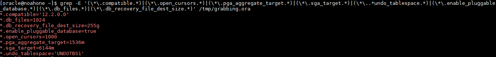

Manual Active Oracle Data Guard
=======================================================

# Table of Contents
* [Assumptions](#Assumptions)
* [Preparing Primary (Source) database](#primary-prep)
* [Preparing Standby (Target) database](#target-prep)
  * [Creating our STANDBY pfile](#pfile_create)
* [Setting up connectivity](#conn-setup)

<!-- ASSUMPTIONS SECTION START -->
<!-- ASSUMPTIONS SECTION START -->
<!-- ASSUMPTIONS SECTION START -->
<a name="Assumptions"></a>
# Assumptions
1. **Source** is Oracle Database 12c EE High Perf Release 12.2.0.1.0 - 64bit Production.
2. **Target** has Oracle Database 12c EE High Perf Release 12.2.0.1.0 - 64bit Production **binaries**.
3. If using OCI, both databases have appropriate security lists that can allow communication both ways.
4. You have the correct password for the SYS user on the source database.
5. Both Oracle environments have been set with .oraenv
6. A NFS shared between the two servers ([Learn how to make an NFS on OCI](https://docs.cloud.oracle.com/en-us/iaas/Content/File/Tasks/creatingfilesystems.htm))


#### Source (PRIMARY) Information
1. ORACLE_SID = NOAHONE
2. ORACLE_UNQNAME = ***NOAHONE_iad2b7***

#### Target (STANDBY) Information
1. ORACLE_SID = NOAHDR
2. ORACLE_UNQNAME = ***NOAHDR_iad38f***

#### What are binaries?
Binaries are when you have Oracle Database software installed, but you do not have any databases provisioned. You can achieve this by adding a new entry to the oratab, and using the same Oracle Home as a running database. You could also just install Oracle Software, or drop the current database.

#### What if I don't know the source SYS password?
***For sake of testing***, you can edit the SYS password like so -:
```
$ sqlplus / as sysdba
SQL> ALTER USER SYS IDENTIFIED BY [password];
SQL> ALTER USER SYSTEM IDENTIFIED BY [password];
SQL> exit
```
Otherwise, contact your DBA

[Top](#Table-of-Contents)
<!-- ASSUMPTIONS SECTION END -->
<!-- ASSUMPTIONS SECTION END -->
<!-- ASSUMPTIONS SECTION END -->

<!-- =========================================================================================== -->

<!-- SOURCE PREP SECTION START -->
<!-- SOURCE PREP SECTION START -->
<!-- SOURCE PREP SECTION START -->

<a name="primary-prep"></a>
# Preparing Primary Source database
First thing, we need to make sure our source database is in ARCHIVELOG mode.
```
$ sqlplus / as sysdba
SQL> select log_mode from v$database;
```


#### Editing source Parameters
Next, we need to enable force logging and flashback on parameters. The parameters may already be enabled, which will give you an error -- but that's okay.
```
$ sqlplus / as sysdba
SQL> alter database force logging;
SQL> alter database flashback ON;
SQL> select force_logging from v$database;
SQL> select flashback_on from v$database;
```


Now, we need to edit these source parameters. I would reccomened copying this into a notepad, and filling it out with your values. You can paste this all at once in SQL, just make sure it's line by line.
```
ALTER SYSTEM SET LOG_ARCHIVE_CONFIG='DG_CONFIG=(source_unqname,target_unqname)' scope=both;
ALTER SYSTEM SET LOG_ARCHIVE_DEST_1='location=USE_DB_RECOVERY_FILE_DEST’;
ALTER SYSTEM SET LOG_ARCHIVE_DEST_2='SERVICE=target_unqname LGWR ASYNC VALID_FOR=(ONLINE_LOGFILES,PRIMARY_ROLE) DB_UNIQUE_NAME=target_unqname' scope=both;
ALTER SYSTEM SET LOG_ARCHIVE_DEST_STATE_1=ENABLE scope=both;
ALTER SYSTEM SET LOG_ARCHIVE_DEST_STATE_2=ENABLE scope=both;
ALTER SYSTEM SET LOG_ARCHIVE_FORMAT='%t_%s_%r.dbf' SCOPE=SPFILE;
ALTER SYSTEM SET LOG_ARCHIVE_MAX_PROCESSES=30 scope=both;
ALTER SYSTEM SET REMOTE_LOGIN_PASSWORDFILE=EXCLUSIVE SCOPE=SPFILE;
ALTER SYSTEM SET fal_client=source_unqname scope=both;
ALTER SYSTEM SET fal_server=target_unqname scope=both;
ALTER SYSTEM SET STANDBY_FILE_MANAGEMENT=AUTO;
```


#### Copying source wallet directory, and password files
By default, OCI encrypts the Database. This means we have to copy both the password file, as well as the contents of the wallet directory from our Source database, and add it to our target database. I am going to copy it to a shared NFS between the two servers. There's other ways like WinSCP, or using Linux Secure Copy (scp).

**How to get the wallet**
```
$ sqlplus / as sysdba
SQL> set lines 200
SQL> col WRL_PARAMETER format a60
SQK> col WRL_TYPE format a10
SQL> col status format a10
SQL> select * from v$encryption_wallet;
```


Now, I'm going to put the wallet contents into my NFS. You can either do this, SFTP them to your desktop, or scp them to the standby database in /tmp/ for now.
```
$ cd /opt/oracle/dcs/commonstore/wallets/tde/source_unqname/
$ mkdir -m 777 /ATX/NOAH/DG_WALLET
$ cp * /ATX/NOAH/DG_WALLET
```


**How to get the password file**
```
$ cd $ORACLE_HOME/dbs
$ cp orapw{source_sid} /ATX/NOAH/DG_WALLET/orapw{target_sid}
```


#### Adding standby redo logs on source database
You need to create standby redo logs on your source for maximum protection. Without creating standby logs, the standby will apply archived logs once they are created by RFS. Since standby cannot apply incomplete archive logs, you can see where the issue arises. [Learn more about it here](https://dbaclass.com/article/standby-redologs-oracle-dataguard/)

**First, check how many current redo logs you have on source**
```
$ sqlplus / as sysdba
$ set lines 180
$ col MEMBER for a60
$ select b.thread#, a.group#, a.member, b.bytes FROM v$logfile a, v$log b WHERE a.group# = b.group#;
```


Now, in our case our thread (node) 1 has three redo logs (group 1,2,3). Usually your database will have a lot more, with multiple threads and unique groups. Now, we need to add standby logs to the source. We're going to add all of the current log count plus one in each group. So in our case, 3+1 = 4 total standby redo logs will be added (for thread 1)

**Steps to add standby logs**

Guidelines -:
  1. You cannot overlap groups (example if you have a redo log in group 1, you cannot add a standby log in group 1).
  2. You determine to amount of standby redo logs to add by taking the current redo log count, and adding one ***for each thread.***
  3. The standby redo logs must match the redo log size.
  4. Usually logs are added to the +RECO directory, but that is decided by the DBA. A lot of DBAs like keeping them seperate, so in our case it would go in +DATA.

Commands to add standby redo logs -:

```
$ sqlplus / as sysdba
SQL> alter database add standby logfile thread 1 group 4 ('+DATA','+RECO') size 1G;
SQL> alter database add standby logfile thread 1 group 5 ('+DATA','+RECO') size 1G;
SQL> alter database add standby logfile thread 1 group 6 ('+DATA','+RECO') size 1G;
SQL> alter database add standby logfile thread 1 group 7 ('+DATA','+RECO') size 1G;
```


Check if they were added successfully (remember I multiplexed) -:
```
$ sqlplus / as sysdba
SQL> set lines 180
SQL> col MEMBER for a60
SQL> select b.thread#, a.group#, a.member, b.bytes FROM v$logfile a, v$standby_log b WHERE a.group# = b.group#;
```


#### Grabbing source parameters for our target (standby) pfile
Last thing, we need to create a pfile from spfile on source (PRIMARY) and grab some of the parameters for our target (STANDBY) pfile.

```
$ sqlplus / as sysdba
SQL> create pfile='/tmp/grabbing.ora' from spfile;
SQL> exit
cat /tmp/grabbing.ora
```


This is going to be a big file, but grab these parameters for later -:
```
*.compatible
*.db_files
*.db_recovery_file_dest_size
*.enable_pluggable_database
*.open_cursors
*.pga_aggregate_target
*.sga_target
*.undo_tablespace (note -: you may have more than one undo, note them all)
```

A quick way to grab these parameters it to do this -:
```
$ grep -E '(\*\.compatible.*)|(\*\.open_cursors.*)|(\*\.pga_aggregate_target.*)|(\*\.sga_target.*)|(\*\..*undo_tablespace.*)|(\*\.enable_pluggable_database.*)|(\*\.db_files.*)|(\*\.db_recovery_file_dest_size.*)' /tmp/grabbing.ora
```


***NOW SAVE THESE FOR STEP Creating our STANDBY pfile***

[Top](#Table-of-Contents)
<!-- SOURCE PREP SECTION END -->
<!-- SOURCE PREP SECTION END -->
<!-- SOURCE PREP SECTION END -->


<!-- =========================================================================================== -->

<!-- TARGET PREP SECTION START -->
<!-- TARGET PREP SECTION START -->
<!-- TARGET PREP SECTION START -->
<a name="target-prep"></a>
# Preparing Standby Target database

#### Copying wallet and password file to standby
This is pretty straight forward, just copy the files from your NFS, Desktop, or /tmp/ folder into their correct places.

**Wallet**

First, grab the location of your target wallet
```
$ sed '/ORACLE_UNQNAME/{s/\(.*ORACLE_UNQNAME\).*/\1/;q}' $ORACLE_HOME/network/admin/sqlnet.ora | sed 's/.*=//'
```


Now, we're going to go to that directory and backup everything so it's empty.
```
$ cd /opt/oracle/dcs/commonstore/wallets/tde/$ORACLE_UNQNAME
$ ls -ltr | wc -l
$ mkdir -m 777 /tmp/wallet_bak
$ mv * /tmp/wallet_bak
$ ls -ltr | wc -l
```
The final wc -l should just be 1


Now, we're going to copy the ***WALLET*** files from our NFS. If you used SFTP then copy from desktop. If you used SCP copy from the /tmp/ directory.
```
$ cd /opt/oracle/dcs/commonstore/wallets/tde/$ORACLE_UNQNAME
$ cp /ATX/NOAH/DG_WALLET/orapw{target_sid} .
```


**Password file**

```
$ cd $ORACLE_HOME/dbs
$ mv orapw{target_sid} BACKUP_orapw{target_sid}
$ cp /ATX/NOAH/DG_WALLET/
$ ls -ltr *orapw*
```


#### Creating an audit directory
You need an audit directory, OCI creates one already for our database but you can create and directory and specify it in the pfile we're going to make below. Just note down the directory, in our case I'm going to use /u01/app/oracle/admin/NOAHDR_iad38f/adump. Since I already have it, I'll just show a screenshot of running ls on it.
```
$ mkdir -m 777 $ORACLE_BASE/admin/target_unqname/adump
```


***NOTE THE DIRECTORY DOWN YOU MADE, FOR FILLING IN THE STANDBY PFILE BELOW***

#### Grabbing the DB domain
Now, the last parameter we need to grab is the db_domain. If you're on OCI, and the two databases are in the same subnet you can just use the db_domain parameter on the source. There are a few ways to grab it regardless, so I'll show you that.

**The best way is to just get the domain in the connect string and take out the DB_UNQNAME like so -:**
```
$ cat $ORACLE_HOME/network/admin/tnsnames.ora
```
Now, once you ran the cat you want to take ***THE CURRENT TARGET DATABASE ENTRY*** Look at the screenshot below for what I mean.


So, our domain name is noahdbssubnet.iris.oraclevcn.com based off of this.

**You can also run this Linux command**
```
$ hostname -A
```


Same concept as above.

**If on OCI, you can check on the instance details page**


***NOTE THE DOMAIN NAME, FOR FILLING IN THE STANDBY PFILE BELOW***

#### Grabbing ASM directory names
Default OCI is just +DATA and +RECO, but I've seen DBAs who have +RECO4, +RECOC, etc... A quick and fast way to check is to just do this. **If for some reason this command doesn't work as Oracle user, change to Grid user.**
```
$ asmcmd ls -l
```


In our case, our ASM data directory is '+DATA', and our ASM reco directory is "+RECO".

***NOTE THE DATA / RECO LOCATION FOR FILLING IN THE STANDBY PFILE BELOW***

<a name="pfile_create"></a>
#### Creating our STANDBY pfile
We need to create a pfile that we can use to startup our empty target (standby) database. Make sure your are doing this on the ***TARGET (STANDBY)*** database. These are the steps -:
```
$ cd $ORACLE_HOME/dbs
$ mv init{target_sid}.ora OLD_init{target_sid}.ora
$ vi init{target_sid}.ora
```

Now, edit the below to fit your parameters and then paste it into the init{target_sid}.ora file, then save and exit the vi editor. ***Don't forget your parameters you grabbed above*** also, don't forget about the **apostrophes  ' '** in some of the parameters. Oracle is pretty specific with errors on trying to startup with a pfile, and it will let you know if there are missing apostrophes.
```
*.audit_file_dest='/u01/app/oracle/admin/target_unqname/adump'
*.audit_trail='db'
*.enable_pluggable_database={grabbed from /tmp/grabbing.ora on source}
*.compatible='{grabbed from /tmp/grabbing.ora on source}'
#*.control_files='+DATA/target_unqname/controlfile/current.268.900456457'
*.db_files={grabbed from /tmp/grabbing.ora on source}
*.db_block_size=8192
*.db_create_file_dest='+DATA'
*.db_domain='{Grabbing the DB domain}'
*.db_name='source_sid'
*.db_unique_name='target_unqname'
*.db_recovery_file_dest='+RECO'
*.db_recovery_file_dest_size={grabbed from /tmp/grabbing.ora on source}
*.diagnostic_dest='/u01/app/oracle'
*.fal_client='target_unqname'
*.fal_server='source_unqname'
*.log_archive_config='DG_CONFIG=(target_unqname,source_unqname)'
*.log_archive_dest_1='location=USE_DB_RECOVERY_FILE_DEST'
*.log_archive_dest_2='SERVICE=source_unqname LGWR ASYNC VALID_FOR=(ONLINE_LOGFILES,PRIMARY_ROLE) DB_UNIQUE_NAME=source_unqname'
*.log_archive_dest_state_1='ENABLE'
*.log_archive_dest_state_2='DEFER'
*.log_archive_format='%t_%s_%r.dbf'
*.open_cursors={grabbed from /tmp/grabbing.ora on source}
*.pga_aggregate_target={grabbed from /tmp/grabbing.ora on source}
*.sga_target={grabbed from /tmp/grabbing.ora on source}
*.remote_login_passwordfile='EXCLUSIVE'
*.standby_file_management='AUTO'
*.undo_tablespace='{grabbed from /tmp/grabbing.ora on source}'
*.log_file_name_convert='+RECO/source_unqname/ONLINELOG','+RECO/target_unqname/ONLINELOG'
*.log_file_name_convert='+DATA/source_unqname/ONLINELOG','+DATA/target_unqname/ONLINELOG'
*.db_file_name_convert='+DATA/source_unqname/DATAFILE','+DATA/target_unqname/DATAFILE'
```

Don't forget to save and exit VI (:x or :wq), and make sure there are no extra lines or missing apostrophes!


#### Starting up the shell standby database with our created PFILE
This is where it can get annoying, but Oracle's error handling

[Top](#Table-of-Contents)
<!-- TARGET PREP SECTION END -->
<!-- TARGET PREP SECTION END -->
<!-- TARGET PREP SECTION END -->

<!-- =========================================================================================== -->

<!-- CONNECTIVITY SECTION START -->
<!-- CONNECTIVITY SECTION START -->
<!-- CONNECTIVITY SECTION START -->


<!-- WIP
<a name="conn-setup"></a>
# Setting up connectivity between source and target
In order to allow cross connection between our two databases, we're going to have to add entries to both tnsnames.ora in $ORACLE_HOME/network/admin. Go ahead and cat the tnsnames.ora, and you can get an idea of what it looks like.

SOURCE
```
$ cat $ORACLE_HOME/network/admin/tnsnames.ora
```


TARGET
```
$ cat $ORACLE_HOME/network/admin/tnsnames.ora
```


#### How to make the two databases able to connect to each other
Now that you have ran cat on both tnsnames.ora, you can edit each one accordingly. For example, on source you will add the target entry below, and vice versa. To do this, you can use vi. Once you edit them, it should look similar to the screenshot below.

***NOTE -: ADD (UR=A) after (CONNECT_DATA = like in the screenshots below***
```
$ vi $ORACLE_HOME/network/admin/tnsnames.ora
```
SOURCE


TARGET


#### Testing database connectivity
TARGET
```
sqlplus sys/[password]@[source_unqname] as sysdba
```

Now, after you can connect to the source let's go ahead and bring up the shell database in nomount


SOURCE
```
sqlplus sys/[password]@[target_unqname] as sysdba
```

[Top](#Table-of-Contents)
<!-- CONNECTIVITY SECTION END -->
<!-- CONNECTIVITY SECTION END -->
<!-- CONNECTIVITY SECTION END -->

<!-- =========================================================================================== -->
